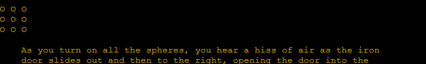
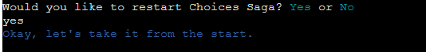

# Choices Saga

Visit the deployed site here: [Choices Saga](https://choices-saga-20bfad436228.herokuapp.com/)

Choices Saga is a Python command line interface (CLI) application that runs the player through an adventure story. Before starting, the player answers a few questions which will make the story a touch more personal and even effect the outcome. Throughout Choices Saga, the player will need to make choices of what to do. Making a wrong choice will end your story while a right choice will drive the story forward. Before being able to complete chapter 1 the player will be challenged by a puzzle. Completing the puzzle will have a more favorable outcome then giving up on the puzzle.

## CONTENTS

* [User Experience](#user-experience-ux)
  * [User Stories](#user-stories)
  * [Planning Process](#planning-process)
  * [Design](#design)
    * [Colour Scheme](#colour-scheme)
    * [Typography](#typography)
    * [Future Implementations](#future-implementations)
* [Features](#features)
* [Technologies](#technologies)
  * [Languages](#languages)
  * [Websites & Programs](#websites-programs)
* [Deployment](#deployment)
* [Testing](#testing)
   * [Validator Test](#validator-test)
   * [Bugs](#bugs)
* [Credits](#credits)
  * [Code Used](#code-used)
  * [Acknowledgments](#acknowledgments)

## User Experience (UX)

### User Stories

#### Visitor Goals

* To play an interactive story game.
* Have an engaging experience, where your choices matter.
* Interesting story and something to challenge you.
* Easy to differentiate between story text, input text and error text.

#### Returning Visitor Goals

* Choosing a different story path 
* Seeing how different answers and choices effect what you do.

## Planning Process

For Choices Saga, I knew I wanted an adventure story with choices at certain points, a 'player' character with different values/items that could effect the story and atleast one puzzle for the user to solve.

* First, I created a player dictonary with some keys and blank values. To fill this in, I added an 'intro' function that asks several questions and fills in the player character by writing to the player dict.
* Second, I thought of a possible puzzle and created the code for it. I encapsulated it into one function so I could call it when needed. For the puzzle, I made sure I could solve it myself first and then worked on creating the code for it. I wanted this puzzle to be the 'high point or climax' of the story, something to challenge the user after making it through most of the story.
* Third, I came up with a basic story idea. Since this would be a whole lot of text, I decide to create a text file for the actual story and read it from my python file. Once I started writing the story, whenever I reached a possible 'choice' point, I would write keywords for the options but contine writing only 1 path until I reached the end of the story. 
* Forth, I went back to all of the 'empty' choice key words and filled in a new story arc, possibly creating new keywords/choices. I did this until there were no empty keywords/choices.
* Last, I created the functions(for each choice) in Python to read the story text(only certain lines) and then tied them together so that the right function would run after each user choice.

For Choices Saga choices and inputs I created a paper flowchart which I later update to a computerize one.

## Design

Visually there was not too much to design with Choices Saga as it is a command line application. Although I did use slowPrint to slowly print out the story text. This way it is not so much text at once, possibly overwhelming the user. Story text is also centered, creating space both infront and behind text printed for easier reading. Also choosing different colors for the text was included, for better user experience.

### Color Scheme

By importing the 'colorama' package, I was able to incorporate different colors for each type of text.
* Green was chosen for only the title 'CHOICES SAGA' so it would stand out more.
* Yellow is used as the story text. To understand what is happening with the story, one will have to read the yellow text. Yellow is also used in the puzzle and the spheres glow a warm light.
* White is used for all input choices the user will need to make. In order for a user to know what choices to make, read the white text.
* Cyan is used for all keywords that the user will need to type, creating an easy visual for the user to understand.
* Red is used for error messages. If the user types wrong input, a red message appears telling the user what they need to do to fix it. Red is also used in the puzzle to clearly show with 'spheres'(X), is not turned on.
* Blue text is used to signify restarting of the game or restarting of the Intro section.
* Magenta was only used once and it is to clearly mark the user ending Choices Saga, exiting program.

Image showing most of the color choices:

### Typography

I kept the original text style from the command line interface, as I like the retro look.

### Future Implementations

1. Adding more story choices in the current chapter.
2. Making the player character items and languages have more effect on the story.
3. Adding more things for the player to interact with.
4. Adding a whole new chapter, new puzzles, and a way to save progress.

## Features

When starting program,the user is welcomed to Choices Saga  and informed that they will need to answer some question before the story starts.

Most of Choices Saga is about the story. The story is spaced in center to help identify the story text.

Throughout the story, the user is faced with choices to make.

When the user advances enough in the story, they will come to a puzzle. The instructions are clear and inform the user of how to play the puzzle.

By typing a number 1 to 9, the user is able to change the Xs into Os.

When the user changes all the Xs into Os, the puzzle is solved. In the story text itself is a very suttle clue on how to solve it. The black iron door which is painted gold in the corner and in the center -- all odd numbers once.

If the user dies or finishes the story, they are able to restart Choices Saga.

If the user chooses to not restart Choices Saga, an exit message will be printed.

## Technologies 

### Languages 

Python was used in the making of Choices Saga.
I imported the following packages:
[Colorama](https://pypi.org/project/colorama/) - I used the colorama Python package to add colors to Choices Saga.
[Time](https://docs.python.org/3/library/time.html) - I used 'Time' to slowly print out the story text, by delaying each character in the text.

###  Websites & Programs 
* [Chatgpt](https://chat.openai.com/) - Used to help identify problems in code and possible way to solve them.
* [Github](https://github.com/) - Created repository and stored files here after commits.
* [Heroku](https://heroku.com/) - For deploying Choices Saga.
* [Microsoft Visual Studio](https://visualstudio.microsoft.com/) - Wrote code and did commits to Github from here.
* [W3 School](https://www.w3schools.com/) Read and used as a guide for some code.
* [Lucid](https://lucid.co/) I used Lucid to develope my flowchart.

## Deployment 

Choices Saga is deployed from Heroku - [Choices Saga](https://choices-saga-20bfad436228.herokuapp.com/).

To Deploy the site from Heroku Pages:

1. Log in or create account in Heroku and then log in.
2. Once logged in, in the upper right hand side of the screen, click 'New' and then 'Create new app'.
3. Choose a name that is not taken, in this case Choices-Saga, and click 'Create app'.
4. From here click the 'Settings' tab.
5. If needed, add Config Vars, otherside continue.
6. Click the 'Add buildpack' and choose, 'python' first and then 'nodejs'. If not chosen in this order you can reorder them by clicking and draging them.
7. Now scroll back up and go to the 'Deploy' tab.
8. Under 'Deployment method' click the 'Github' button and connect to your github account.
9. Choose your deployment method -- Automatic or Manual. Automatic is easier but you do not have as much control over deployement as in manual. Choices Saga used automatic, but you are able to switch when ever you want.

#### How to Fork in Github

If you want to fork this repository in Github:

1. Go to the repository for this project [Choices Saga](https://github.com/reltoom/Choices-Saga).
2. In the upper right hand area of the screen, click the 'Fork' button.
3. Then when the menu drops down, click 'Create New Fork'. (If you are the owner of a repository, you cannot fork.) 

#### How to Clone in Github

If you want to clone this repository:

1. Go to the repository for this project [Choices Saga](https://github.com/reltoom/Choices-Saga).
3. Click on the green 'Code' button and then select how you would like to clone: HTTPS, SSH or GitHub CLI (under the 'local' tab). 
4. Either copy the desired code or click to open with another program from the list below the code.
4. Open your code editor and go to 'Clone Repository' usually under 'File'.
5. Paste if your code and then 'Clone'.

## Testing

Choices Saga has been tested on: Chrome, Microsoft Edge and Safari and works equally well on each.

Each user input has been tested with incorrect input to test validation errors making sure all key strokes are accounted for. This has been done several times for each user Choice as well as Intro and Puzzle section. Puzzle runs within the proper paramaters and is solvable.

I had have friends and my brothers test the game and check user error possiblities.

## Validator Test

[Pep8 Python Validator](https://pep8ci.herokuapp.com/) is used to validate Choices Saga python code.

There are no errors in Choices Saga!

### Bugs

Here are some, but not all, of the bugs that were fixed during development. 

| Bug | Fix |
| :--- | :--- |
| In the toggle function, after user input, the grid was not updating properly | Had to recreate grid using new values |
| Used long and repetative code to create grid and update adjacent cells | Created an adjacents dictonary and ran through it with a for loop to check and update properly. |
| After game restart, it was skipping over story sections | Deleted True False global variables that were used to track progress. Called function directly after user input to go to next section instead | 
| Stuck in a While loop | Had forgotten to add a return value or break |
| When printing puzzle grid it was all coming on one line  | Added a empty print() inside the outter loop so it would jump to a new line after printing each row |
| Reading over from text file was not showing update player dictonary values | Was missing the .items() to player in function trying to replace words |
| Input was not accepting lowercase form of the words | Added the missing '.lower()' to the variable matching user input |
| Typing 'give up' throws Traceback error + others errors | Had 'Fore.Yellow' inside parameter for naming a variable, should only be for print or slowPrint, So deleted it from there |
| On restart question, typing wrong input caused nothing to happen but going to previous player choice | Had forgotten to wrap everything in a 'while True' and 'else' statement. |
| If user wrote Swedish for language, it was still not going down right story path | I had changed to compare lowercase 'Swedish' and then print it to player dict. but it was still checking for an Uppercase 'Swedish' in story choice. Made it lower case and fixed issue. |

There are no unsolved errors.

## Credits

### Code Used

Using the tutorial videos from Code Institute and some help from Chatgpt, I was able to figure out and construct the code for Choices Saga. There was alot of trial error and some hindsight for future developments.

For all of the functions, especially with while loops, I had to write down and draw what I was trying to achieve so that I could visualize it better. Going through it step by step helped create the work I did.

Structure for the README file is from my project [Ways to Relax](https://github.com/reltoom/Project-1-Relax) adjusted to fit Choices Saga.

### Acknowledgments

Thank you to my daughter and wife for helping support me through my studies.

Thank you to the Swedish Slack channel for keeping my spirits high.

Thank you to my friends on the great feeback to my project.
